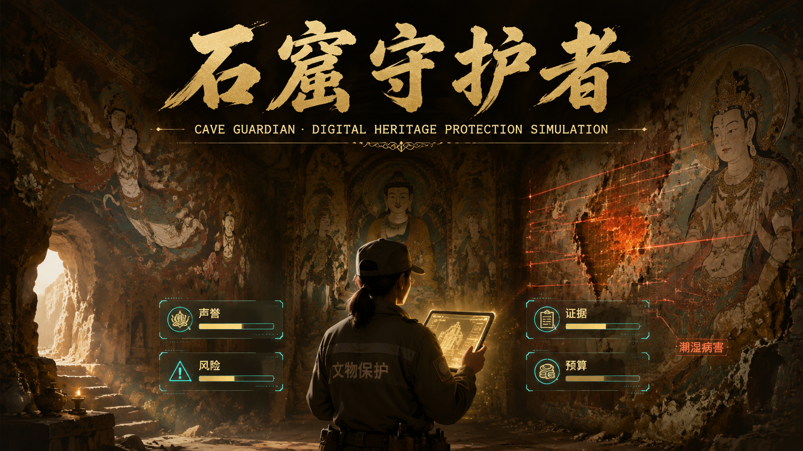

# 石窟守护者

一款以敦煌莫高窟数字化保护为主题的叙事策略小游戏。玩家扮演数字文物保护管理者，在预算有限、风险累积和证据采集压力并存的情况下，完成石窟巡检、壁画修复、环境监测与档案提交等任务。



## 项目简介

《石窟守护者》将文化遗产保护议题转化为可交互的游戏体验。玩家需要在“保护优先”和“现实约束”之间做出选择：是坚持专业方案、采用折中方案，还是冒险使用激进手段。每一次选择都会影响后续局势，并最终导向不同结局。

游戏的核心循环为：

```text
探索场景 -> 做出决策 -> 完成小游戏 -> 属性变化 -> 推进任务
```

## 核心玩法

- 俯视角探索石窟场景，前往不同监测点触发任务。
- 每个任务节点提供专业、妥协、激进三类方案。
- 决策后进入叙事绑定小游戏，例如描摹潮湿边界、校准传感器、修复壁画拼图。
- 四项核心属性贯穿全程：声誉、风险、证据、预算。
- 当风险过高或资源失衡时，会触发预警、转换或提前结局。

## 系统特色

- **三选一决策哲学**：没有绝对正确答案，玩家需要在专业伦理、资源限制和短期收益之间权衡。
- **叙事绑定小游戏**：小游戏不是独立关卡，而是保护行动本身的可操作化表达。
- **多结局与因果回溯**：根据最终属性和关键选择生成差异化结局，并展示关键决策如何影响结果。
- **属性转换系统**：任务间可以消耗一种资源换取另一种资源，为困境提供策略空间。
- **复玩目标**：通过成就、挑战模式和周目统计鼓励玩家尝试不同保护路线。

## 技术栈

- Vite
- React
- TypeScript
- Phaser 4
- Framer Motion
- Lucide React
- Vitest

## 项目结构

```text
src/
  audio/       音频辅助逻辑
  components/  React 界面组件
  data/        游戏数据与数值配置
  events/      React 与 Phaser 的事件通信
  hooks/       React hooks 与状态逻辑
  phaser/      Phaser 场景、地图与游戏世界逻辑
  types/       共享 TypeScript 类型
docs/          游戏设计文档
public/        静态资源与主视觉素材
```

## 快速开始

安装依赖：

```bash
npm install
```

启动开发服务器：

```bash
npm run dev
```

默认会以 Vite 开发模式启动，可在浏览器中打开终端输出的本地地址进行试玩。

## 常用命令

```bash
npm run dev          # 启动开发服务器
npm run build        # TypeScript 检查并生成生产构建
npm run preview      # 本地预览生产构建
npm test             # 运行 Vitest 测试
npm run test:watch   # 以监听模式运行测试
```

## 开发说明

- React UI 放在 `src/components/`。
- Phaser 场景和地图逻辑放在 `src/phaser/`。
- 共享类型放在 `src/types/`。
- 游戏数据、任务和数值平衡逻辑放在 `src/data/`。
- React 与 Phaser 之间优先通过 `src/events/` 中的事件机制通信。
- 详细玩法与数值设计可参考 `docs/` 目录下的 GDD 文档。

